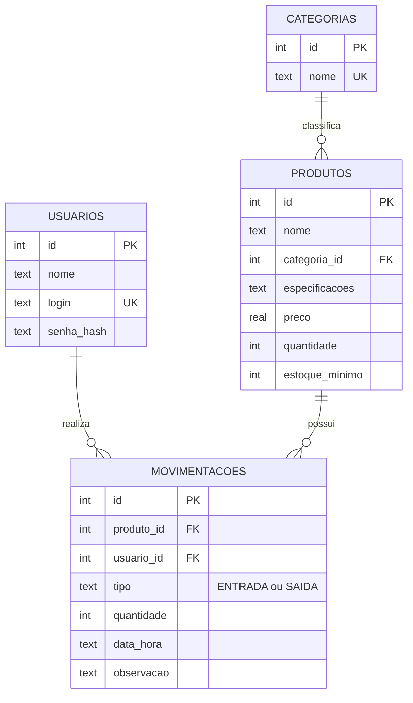

# Diagrama Entidade-Relacionamento (DER)



Versão em texto (para desenhar à mão na prova):

```
CATEGORIAS 1 ────< N PRODUTOS 1 ────< N MOVIMENTACOES N >──── 1 USUARIOS
```

Cardinalidades: uma categoria tem vários produtos; um produto tem várias movimentações; um usuário realiza várias movimentações.
Para visualizar o diagrama Mermaid: cole o bloco em https://mermaid.live ou abra este arquivo no VS Code/GitHub.
